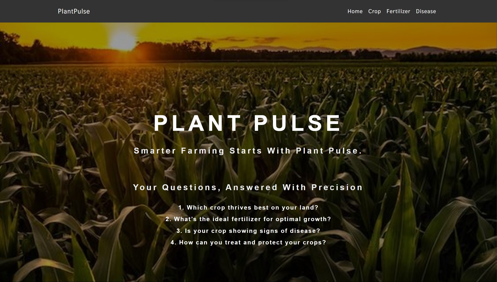
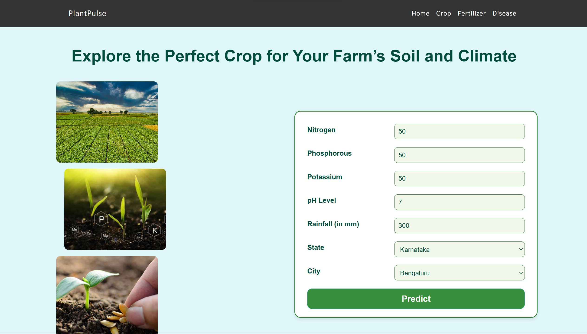
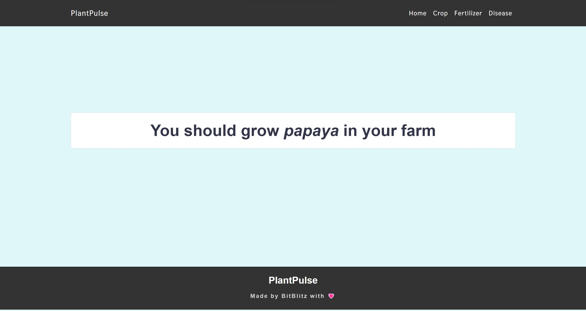
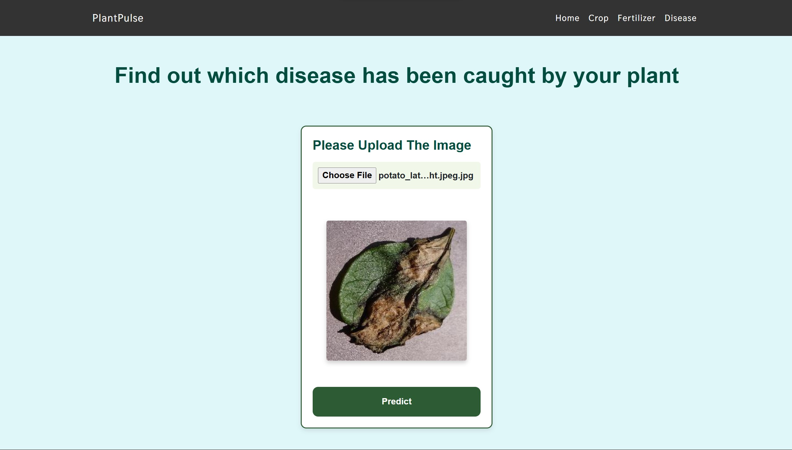
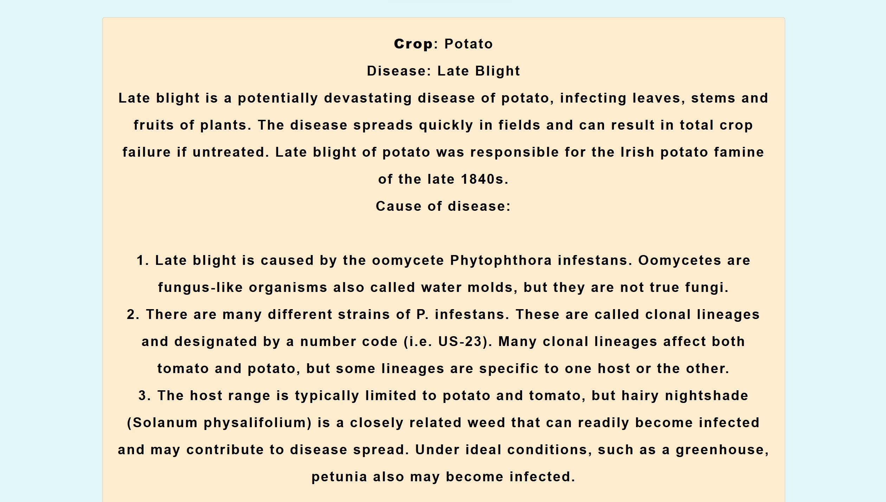
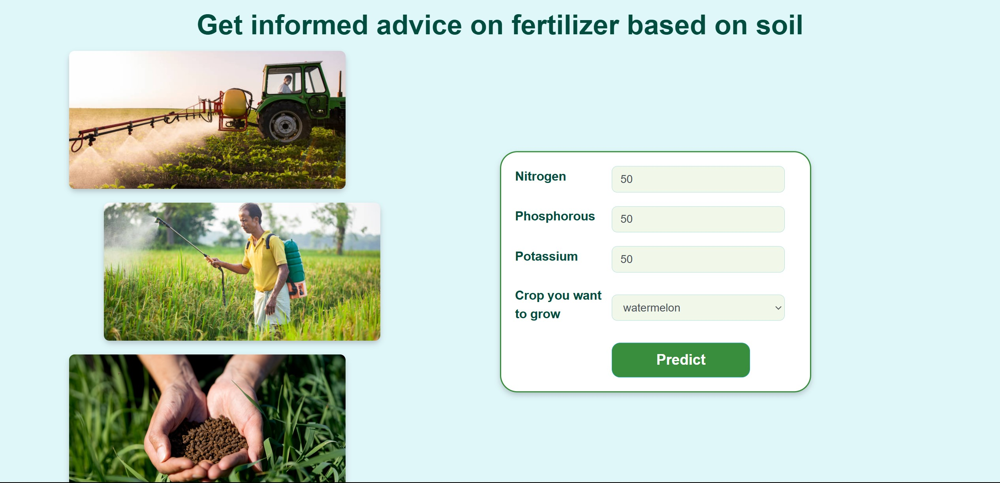
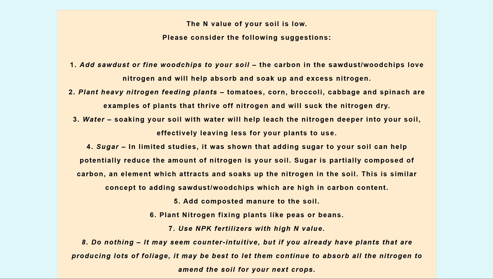

# 🌱 Plant Pulse  
**Your Smart Guide to Plant Health and Optimization**

Welcome to **Plant Pulse**, a revolutionary web platform designed to assist farmers, gardeners, and agricultural enthusiasts in making data-driven decisions for crop management. Leveraging the power of artificial intelligence, Plant Pulse provides tailored crop recommendations, early disease detection, and optimal fertilizer suggestions. With a user-friendly interface and powerful backend, Plant Pulse aims to enhance agricultural productivity and sustainability.

---

## 🚀 Features  
- **Home Page**: Intuitive and responsive UI for a seamless user experience.  
- **Crop Recommendation**: AI-powered suggestions for the best crops based on soil and environmental conditions.  
- **Disease Prediction**: Identify and predict plant diseases using advanced machine learning models to prevent potential losses.  
- **Fertilizer Prediction**: Personalized fertilizer recommendations tailored to crop-specific requirements.  
- **Interactive Results**: Visual and textual insights to help users understand recommendations effectively.  

---

## 🛠️ Tech Stack  
### **Frontend**:  
- HTML, CSS, JavaScript  
- Bootstrap for responsive design  

### **Backend**:  
- Flask for API development  
- Python for machine learning models  

### **AI/ML**:  
- Scikit-learn for model training and prediction  

---

## 📂 Folder Structure  
```plaintext
PlantPulse/
├── APP/               # Application files and code
├── Data-processed/    # Processed data used for analysis and predictions
├── Data-raw/          # Raw data collected for the project
├── models/            # Machine learning models
├── notebook/          # Jupyter notebooks for experiments and analysis
├── ss/                # Screenshots for documentation and visuals
├── check/             # Miscellaneous or temporary files
├── README.md          # Project documentation
```

---

## 🖥️ How to Run the Project  
1. **Clone the repository**:  
   ```bash
   git clone https://github.com/YourUsername/PlantPulse.git
   cd PlantPulse
   ```
2. **Create a virtual environment** (optional but recommended):  
   ```bash
   python -m venv venv
   source venv/bin/activate    # For Mac/Linux
   venv\Scripts\activate       # For Windows
   ```
3. **Install dependencies**:  
   ```bash
   pip install -r requirements.txt
   ```
4. **Run the Flask application**:  
   ```bash
   python app.py
   ```
5. **Open in browser**:  
   Navigate to `http://127.0.0.1:5000` to explore the platform.

---

## 📸 Screenshots  

1. **Home Page**  
  

2. **Crop Recommendation Input**  
  

3. **Crop Recommendation Output**  
  

4. **Disease Prediction Input**  
  

5. **Disease Prediction Output**  
  

6. **Fertilizer Prediction Input**  
  

7. **Fertilizer Prediction Output**  
  

---

## ✨ Contributors  
<div align="center">
  <figure style="display: inline-block; text-align: center; margin: 0 20px;">
    <a href="https://github.com/Riya-jalan">
      
    </a>
    <figcaption>Riya Jalan</figcaption>
  </figure>
  
  <figure style="display: inline-block; text-align: center; margin: 0 20px;">
    <a href="https://github.com/Sameeksha0329">
      
    </a>
    <figcaption>Sameeksha</figcaption>
  </figure>
  
  <figure style="display: inline-block; text-align: center; margin: 0 20px;">
    <a href="https://github.com/Nish-037">
      
    </a>
    <figcaption>Nishvika</figcaption>
  </figure>
</div>


---
